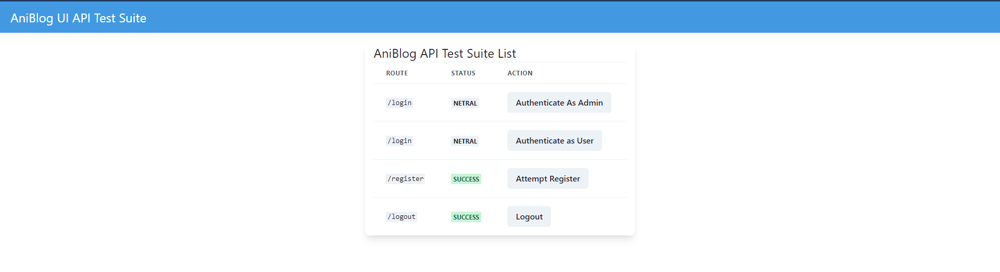

## AniBlog Front End Testing Suite

> This repository is a test suite for AniBlog Back End.

Since making test about SPA Authentication in Laravel is kinda pain. So i decided to make a dummy front end for testing purpose only.

## Installation

Install using `pnpm install`.

## Serving Up

Execute `npm install` and you're good to go.

## Notice

This test must run in same top level domain with the Backend.